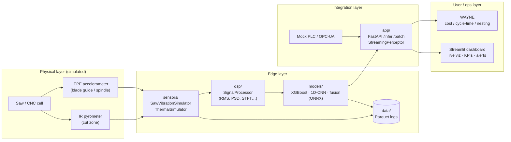

# Argus Panoptes — Industrial Perception Stack

> A runnable, multi-modal **industrial perception prototype** for aluminum
> sawing and CNC machining cells. It owns the perception layer — **vibration,
> thermal (and vision hooks)** — that feeds accurate data into job costing,
> cycle-time prediction, and nesting optimization (making **WAYNE** accurate).
>
> Built with heavy emphasis on **signal processing for blade-wear and
> cut-condition monitoring** using **physics-informed synthetic data**.

Named after the hundred-eyed, ever-watchful giant of Greek myth — always
watching the factory floor.

---

## Status

| Layer                                   | Module          | Status               |
| --------------------------------------- | --------------- | -------------------- |
| **Synthetic data generator**            | `sensors/`      | ✅ **v1 complete**   |
| DSP & feature extraction                | `dsp/`          | 🚧 scaffold (Day 1–2)|
| ML pipeline & experiments               | `models/`       | 🚧 scaffold (Day 2–3)|
| Inference, FastAPI, Streamlit           | `app/`          | 🚧 scaffold (Day 4–5)|
| Docker / edge                           | `deployment/`   | 🚧 scaffold (Day 6)  |

This repository currently delivers a **production-quality v1 of the `sensors/`
module**: physics-informed vibration + thermal simulators, labels, validation,
tests, and a Parquet dataset-generation pipeline. The rest of the structure is
scaffolded so the one-week plan can proceed immediately.

---

## Architecture



---

## Quickstart

```bash
# 1. Install (Python 3.11+)
pip install -r requirements.txt

# 2. Validate the physics simulators (prints sanity metrics + saves plots)
python scripts/validate_simulators.py

# 3. Run the test suite
pytest

# 4. Generate a labeled synthetic dataset (Parquet)
python scripts/generate_dataset.py --num-samples 500 --output-dir data/synthetic_v1
```

Outputs:

- Validation plots → `experiments/plots/`
- Dataset → `data/synthetic_v1/` (partitioned Parquet + `manifest.parquet`)

---

## The `sensors/` module (v1 deliverable)

Physics-informed generators for **blade-wear and cut-condition monitoring**:

- **`SawVibrationSimulator`** — 40.96 kHz acceleration (g) with tooth-pass
  frequency + harmonics, wear-modulated impact amplitude and broadband noise,
  configurable structural modes and sensor noise. TPF is derived *exactly* from
  saw kinematics; impact amplitude follows a **force ≈ specific-energy × chip-area**
  model that rises with wear.
- **`ThermalSimulator`** — lumped first-order cut-zone temperature model where
  wear scales the friction-heat term (100–400 °C band for aluminum).
- **Auto labels** — wear, RUL, cycle-time factor, quality score, health state,
  anomaly flag — plus rich metadata for every recording.

See [`sensors/README.md`](sensors/README.md) for the full physics write-up,
mounting realism, and usage.

---

## Repository layout

```
ArgusPanoptes/
├── sensors/            # ✅ physics-informed synthetic signal generation (v1)
│   ├── sensor_specs.yaml
│   ├── config.py       # pydantic config + loader
│   ├── utils.py        # kinematics, force model, signal & label helpers
│   ├── vibration_simulator.py
│   ├── thermal_simulator.py
│   └── README.md
├── dsp/                # 🚧 feature extraction (scaffold)
├── models/             # 🚧 ML pipeline (scaffold)
├── app/                # 🚧 FastAPI + Streamlit (scaffold)
├── deployment/         # 🚧 Dockerfile + compose (scaffold)
├── experiments/        # notebooks + generated plots
├── scripts/
│   ├── validate_simulators.py
│   └── generate_dataset.py
├── tests/              # pytest suites for the simulators
├── data/               # generated Parquet (git-ignored)
├── requirements.txt / pyproject.toml
└── README.md
```

---

## Tech stack

Python 3.11+ · NumPy · SciPy (signal, fft, welch) · Pandas · PyArrow (Parquet) ·
Pydantic · PyYAML · Matplotlib · pytest.
ML/app dependencies (PyTorch, ONNX, FastAPI, Streamlit, Plotly) are deferred to
later days of the plan and intentionally kept out of the core install.

---

## Job mapping (Nox Metals — Perception Engineer)

This prototype maps 1:1 to the role: **owning the full perception stack**
(sensors on saws/CNC), **vibration for blade wear** and **thermal for cut
conditions**, an **end-to-end pipeline** (sensor → DSP → labeling → ML →
edge/cloud inference → monitoring), **Parquet data capture** for ML/ops, **clean
API interfaces** feeding cost/nesting models (WAYNE), **experiments/ablations**,
and a **builder mindset** shipping a quality v1 fast.

---

## Roadmap

Day 1 ✅ sensors + validation → Day 2 dataset + XGBoost baseline → Day 3 DL +
ONNX → Day 4 streaming + FastAPI → Day 5 Streamlit + WAYNE mock → Day 6
experiments + Docker/edge → Day 7 polish + demo. Future: swap simulators for a
real DAQ (Pi + MPU6050 + MLX90640) and add vision depth.
