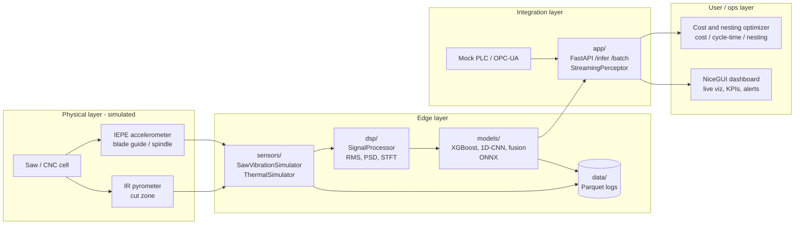

# Argus Panoptes — Industrial Perception Stack

> A runnable, multi-modal **industrial perception prototype** for aluminum
> sawing and CNC machining cells. It owns the perception layer — **vibration,
> thermal (and vision hooks)** — that feeds accurate data into job costing,
> cycle-time prediction, and nesting optimization.
>
> Built with heavy emphasis on **signal processing for blade-wear and
> cut-condition monitoring** using **physics-informed synthetic data**.

Named after the hundred-eyed, ever-watchful giant of Greek myth — always
watching the factory floor.

---

## Status

| Layer                                   | Module          | Status                              |
| --------------------------------------- | --------------- | ----------------------------------- |
| **Synthetic data generator**            | `sensors/`      | v1 complete                         |
| **DSP & feature extraction**            | `dsp/`          | v1 implemented + DL input methods   |
| **ML pipeline & experiments**           | `models/`       | XGBoost baseline + ablations · DL + ONNX · hardened (noise aug, norm ablation) |
| **Streaming inference + FastAPI**       | `app/`          | StreamingPerceptor, Parquet logging, `/infer` `/batch` |
| **Operator dashboard (NiceGUI)**        | `app/nicegui_dashboard.py` | Live monitor, lab, history, optimization sandbox (Streamlit v1 in `_legacy/`) |
| Docker / edge                           | `deployment/`   | scaffold                            |

The stack delivers physics-informed vibration + thermal simulators, a modular
`SignalProcessor`, interpretable XGBoost baselines, deep-learning models
(1D-CNN, spectrogram CNN, fusion) with ONNX export, streaming inference, and an
operator dashboard. See module READMEs for install and usage details.

---

## Architecture



---

## Quickstart

```bash
pip install -r requirements.txt
python scripts/validate_simulators.py
pytest
```

| Module | README |
| --- | --- |
| Synthetic signals | [`sensors/README.md`](sensors/README.md) |
| DSP & features | [`dsp/README.md`](dsp/README.md) |
| ML training & ONNX | [`models/README.md`](models/README.md) |
| API, streaming & dashboard | [`app/README.md`](app/README.md) |
| Docker / edge | [`deployment/README.md`](deployment/README.md) |

Experiment results: [`experiments/baseline_results.md`](experiments/baseline_results.md) · [`experiments/dl_results.md`](experiments/dl_results.md)

---

## Tech stack

Python 3.11+ · NumPy · SciPy · Pandas · PyArrow · Pydantic · PyYAML · Matplotlib ·
pytest. Optional extras: `[ml]` (scikit-learn, XGBoost), `[dl]` (PyTorch, ONNX,
ONNX Runtime), `[app]` (FastAPI, uvicorn), `[dashboard-nicegui]` (NiceGUI, Plotly).
The inference service is **torch-free** at runtime (DL via ONNX Runtime).
