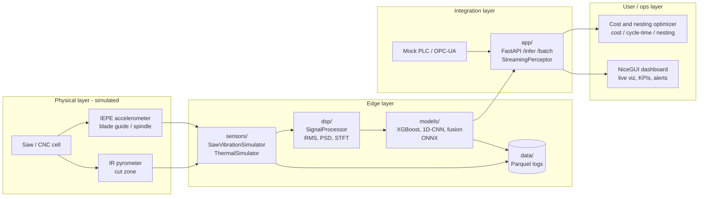

# Argus Panoptes — Industrial Perception Stack

> A runnable, multi-modal **industrial perception prototype** for aluminum
> sawing and CNC machining cells. It owns the perception layer — **vibration,
> thermal (and vision hooks)** — that feeds accurate data into job costing,
> cycle-time prediction, and nesting optimization (making the downstream
> **cost & nesting optimizer** accurate).
>
> Built with heavy emphasis on **signal processing for blade-wear and
> cut-condition monitoring** using **physics-informed synthetic data**.

Named after the hundred-eyed, ever-watchful giant of Greek myth — always
watching the factory floor.

---

## Status

| Layer                                   | Module          | Status                              |
| --------------------------------------- | --------------- | ----------------------------------- |
| **Synthetic data generator**            | `sensors/`      | ✅ **v1 complete**                  |
| **DSP & feature extraction**            | `dsp/`          | ✅ **v1 implemented (Day 2)** + DL input methods (Day 3) |
| **ML pipeline & experiments**           | `models/`       | ✅ XGBoost baseline + ablations (Day 2) · ✅ DL + ONNX (Day 3) · ✅ hardened (noise aug, norm ablation) |
| **Streaming inference + FastAPI**       | `app/`          | ✅ **Day 4 complete** (StreamingPerceptor, Parquet logging, `/infer` `/batch`) |
| **Operator dashboard (NiceGUI)**        | `app/nicegui_dashboard.py` | ✅ **Day 5 complete** (smooth live monitor, lab, history, optimization sandbox; Streamlit v1 archived in `_legacy/`) |
| Docker / edge                           | `deployment/`   | 🚧 scaffold (Day 6)                 |

This repository currently delivers a **production-quality v1 of the `sensors/`,
`dsp/`, and `models/` modules**: physics-informed vibration + thermal simulators,
labels, validation, a Parquet dataset-generation pipeline, a modular
`SignalProcessor` that extracts time/frequency features (including
tooth-pass-relative band energies), interpretable **XGBoost baselines +
ablations**, and **deep-learning models** (1D-CNN, spectrogram CNN, and
vibration+thermal fusion) with **ONNX export + CPU edge benchmarks**, configurable
**training-time noise augmentation**, and a **noise-robustness / normalization
ablation**. Day 3 hardening confirmed `normalize_for_dl="none"` closes the DL
accuracy gap to XGBoost on clean data, while noise augmentation hardens zscore
models against sensor corruption. The remaining layers are scaffolded so the one-week
plan can proceed immediately.

---

## Architecture



---

## Quickstart

```bash
# 1. Install (Python 3.11+)
pip install -r requirements.txt

# 2. Validate the physics simulators (prints sanity metrics + saves plots)
python scripts/validate_simulators.py

# 3. Run the test suite
pytest

# 4. Generate a labeled synthetic dataset (Parquet)
python scripts/generate_dataset.py --num-samples 500 --output-dir data/synthetic_v1

# 5. (Optional) Generate with DSP features + train the XGBoost baseline
pip install -e ".[ml]"   # scikit-learn, xgboost, joblib
python scripts/generate_dataset.py --num-samples 300 --output-dir data/synthetic_v1 --extract-features
python models/baseline.py --data-dir data/synthetic_v1

# 6. (Optional) Deep learning + ONNX edge benchmarks (Day 3)
pip install -e ".[ml,dl]"   # + torch, onnx, onnxruntime
# Generate a DL-ready dataset (fixed 1 s chunks, DSP features + spectrogram recipe):
python scripts/generate_dataset.py --num-samples 2500 --output-dir data/dl_v1 \
    --seed 42 --duration-s 1.0 --extract-features --compute-spectrogram
# Train the three DL models (each prints an XGBoost comparison on the same split):
python models/train_dl.py --model 1dcnn       --data-dir data/dl_v1 --epochs 40
python models/train_dl.py --model spectrogram --data-dir data/dl_v1 --epochs 40
python models/train_dl.py --model fusion      --data-dir data/dl_v1 --epochs 40
# Optional: noise augmentation or amplitude-preserving normalization:
python models/train_dl.py --model fusion --data-dir data/dl_v1 --train-noise-sd 0.15 --output-suffix _noisy
python models/train_dl.py --model fusion --data-dir data/dl_v1 --normalize-for-dl none --output-suffix _normnone
# Benchmark ONNX CPU latency and run the noise-robustness ablation:
python scripts/benchmark_onnx.py --model fusion --device cpu
python experiments/robustness_ablation.py --data-dir data/dl_v1

# 7. (Day 4) Streaming inference + FastAPI service
pip install -e ".[ml,dl,app]"   # + fastapi, uvicorn, python-multipart, httpx
# Live simulator -> StreamingPerceptor -> DSP + model -> Parquet log -> payloads:
python scripts/stream_demo.py --model 1dcnn_normnone --duration-s 5 --wear 0.6
# Start the HTTP service (interactive docs at http://127.0.0.1:8000/docs):
uvicorn app.main:app --reload
# Example single-chunk inference:
curl -X POST "http://127.0.0.1:8000/infer" \
    -H "Content-Type: application/json" \
    -d '{"model": "1dcnn_normnone", "vibration": [0.1, 0.2, -0.1, 0.05], "fs_hz": 40960}'
```

### Dashboard (Day 5)

The operator dashboard is a high-performance **NiceGUI + Plotly** app
(`app/nicegui_dashboard.py`). Its WebSocket-backed reactive updates, a single
`ui.timer`, and a decoupled background `SimulationOrchestrator` thread deliver
smooth, flicker-free multi-stream live visualization at a stable ~5–10 Hz.
Install the `dashboard-nicegui` extra alongside the model artifacts you want to
load, then launch it:

```bash
pip install -e ".[ml,dl,app,dashboard-nicegui]"
python -m app.nicegui_dashboard        # or: python app/nicegui_dashboard.py
```

The UI opens at `http://127.0.0.1:8080`. **Standalone (direct)** mode runs an
in-process `StreamingPerceptor` for the lowest-latency demos and screen recordings.
**Connected to API** mode calls the FastAPI service (`uvicorn app.main:app --reload`) over
HTTP for a true client/server showcase (toggle it in the left control drawer, or set
`ARGUS_DASHBOARD_USE_API=1` / `ARGUS_API_BASE_URL=...`).

| Tab | Purpose |
| --- | --- |
| **Live Monitor** | Real-time waveform / FFT / STFT, KPI gauges, alerts, recommendations; self-refreshing live simulation via demo scenarios |
| **Simulation Lab** | Presets + single / multi-model / robustness-batch runs |
| **Historical Explorer** | Query partitioned Parquet inference logs, trend charts, record drill-down (re-simulate + re-infer from a logged operating point) |
| **Optimization Sandbox** | Transparent downstream production-impact model + structured planner payload |
| **System & Models** | Model inventory, ONNX latency benchmarks, robustness notes, config inspector |

**Demo usage:** on the **Live Monitor** pick a **Scenario** and click **Launch scenario**
for a one-click, repeatable live run (Normal Operation, Progressive Wear, Sudden Anomaly,
Noisy Sensor Robustness). Enable **Persist live predictions to Parquet** in the drawer's
Utilities so Historical Explorer picks up live runs. Generate seed logs with:

```bash
python scripts/stream_demo.py --model 1dcnn_normnone --duration-s 5 --wear 0.6
```

> The original Streamlit dashboard has been **superseded** for performance reasons and
> archived under `_legacy/` (see `_legacy/README.md`); the legacy `dashboard` extra
> (`pip install -e ".[dashboard]"`) still runs it.

<!-- Screenshots / GIFs: add `docs/dashboard-live.png`, `docs/dashboard-lab.png` here -->

### Streaming → perceptor → API in one snippet

```python
from sensors import SawVibrationSimulator
from models.streaming_perceptor import StreamingPerceptor

perc = StreamingPerceptor(model="1dcnn_normnone", chunk_s=1.0,
                          logger={"log_dir": "logs/inference"}).load()
sim = SawVibrationSimulator()
for result in perc.stream_from_simulator(sim, duration_s=3.0, wear=0.7, seed=0):
    p = result["predictions"]
    print(p["health_state"], round(p["wear_level"], 3),
          "->", result["recommendations"]["action"])
perc.close()  # flush Parquet logs
```

Inference logs land under `logs/inference/` as a partitioned Parquet dataset
(`records/` by `date`/`model` + a scalar `manifest.parquet`). Read them back with
`from app.logging import read_logs; read_logs("logs/inference")` or any
`pyarrow.dataset` query. See [`app/README.md`](app/README.md) for the full API,
endpoints, env-var config, and model-selection details.

Outputs:

- Validation plots → `experiments/plots/`
- Dataset → `data/synthetic_v1/`:
  - `records/` — Parquet partitioned by `alloy` / `wear_bin`, with raw
    `vibration_waveform` and `thermal_waveform` list columns.
  - `manifest.parquet` — tabular metadata + labels only (fast to query).

Reading it back:

```python
import pandas as pd, pyarrow as pa, pyarrow.dataset as ds

# Fast metadata/label queries + stats:
meta = pd.read_parquet("data/synthetic_v1/manifest.parquet")

# Waveforms with predicate pushdown (alloy values are numeric-looking,
# so pass an explicit string partition schema):
part = ds.partitioning(
    schema=pa.schema([("alloy", pa.string()), ("wear_bin", pa.string())]),
    flavor="hive",
)
d = ds.dataset("data/synthetic_v1/records", partitioning=part, format="parquet")
table = d.to_table(filter=ds.field("wear_bin") == "0.8-1.0")
```

---

## The `sensors/` module (v1 deliverable)

Physics-informed generators for **blade-wear and cut-condition monitoring**:

- **`SawVibrationSimulator`** — 40.96 kHz acceleration (g) with tooth-pass
  frequency + harmonics, wear-modulated impact amplitude and broadband noise,
  configurable structural modes and sensor noise. TPF is derived *exactly* from
  saw kinematics; impact amplitude follows a **force ≈ specific-energy × chip-area**
  model that rises with wear.
- **`ThermalSimulator`** — lumped first-order cut-zone temperature model where
  wear scales the friction-heat term (100–400 °C band for aluminum).
- **Auto labels** — wear, RUL, cycle-time factor, quality score, health state,
  anomaly flag — plus rich metadata for every recording.

See [`sensors/README.md`](sensors/README.md) for the full physics write-up,
mounting realism, and usage.

---

## Repository layout

```
ArgusPanoptes/
├── sensors/            # ✅ physics-informed synthetic signal generation (v1)
│   ├── sensor_specs.yaml
│   ├── config.py       # pydantic config + loader
│   ├── utils.py        # kinematics, force model, signal & label helpers
│   ├── vibration_simulator.py
│   ├── thermal_simulator.py
│   └── README.md
├── dsp/                # ✅ SignalProcessor: features + STFT + DL input methods
│   ├── processor_config.yaml   # + dl: (normalize_for_dl) + CNN-tuned stft:
│   ├── config.py       # pydantic config + loader
│   └── signal_processor.py
├── models/             # ✅ XGBoost baseline (Day 2) + DL + ONNX (Day 3)
│   ├── baseline.py         # XGBoost + ablations
│   ├── dl_models.py        # Vibration1DCNN / SpectrogramCNN / FusionModel + ONNX
│   ├── dl_data.py          # Parquet -> PyTorch loaders (same split as baseline)
│   ├── train_dl.py         # DL training CLI (+ same-split XGBoost comparison)
│   ├── onnx_inference.py   # ONNXPerceptor (torch-free edge inference)
│   └── streaming_perceptor.py  # ✅ StreamingPerceptor (ring buffer + DSP + model)
├── app/                # ✅ FastAPI service + Parquet logging (Day 4) + dashboard (Day 5)
│   ├── main.py             # /infer /batch /health /models
│   ├── logging.py          # InferenceLogger -> partitioned Parquet
│   ├── config.py           # ARGUS_* env-var config
│   ├── nicegui_dashboard.py  # ✅ NiceGUI + Plotly operator dashboard (entry point)
│   └── README.md
├── dashviz/            # ✅ UI-agnostic dashboard building blocks (Day 5)
│   ├── theme.py            # dark industrial theme + styled components
│   ├── plots.py            # Plotly figure builders (waveform, FFT, STFT, gauges)
│   ├── orchestrator.py     # SimulationOrchestrator: bg thread, snapshots, unified inference
│   ├── optimization.py     # downstream production-impact model
│   ├── scenarios.py        # pre-built demo scenarios
│   └── metrics.py          # experiment metric JSON loaders
├── _legacy/            # 🗄️ archived Streamlit dashboard v1 (dashboard.py + infra.py)
├── deployment/         # ✅ Dockerfile + compose (api + NiceGUI dashboard + datagen)
├── experiments/        # notebooks + generated plots + robustness ablation
│   └── robustness_ablation.py
├── scripts/
│   ├── validate_simulators.py
│   ├── generate_dataset.py     # --extract-features / --compute-spectrogram
│   ├── benchmark_onnx.py       # ONNX Runtime CPU latency benchmark
│   └── stream_demo.py          # ✅ live simulator -> perceptor -> Parquet demo
├── tests/              # pytest suites for the simulators
├── data/               # generated Parquet (git-ignored)
├── requirements.txt / pyproject.toml
└── README.md
```

---

## Tech stack

Python 3.11+ · NumPy · SciPy (signal, fft, welch) · Pandas · PyArrow (Parquet) ·
Pydantic · PyYAML · Matplotlib · pytest. ML via the `[ml]` extra (scikit-learn,
XGBoost, joblib); DL + edge export via the `[dl]` extra (PyTorch, ONNX, ONNX
Runtime); the streaming inference service via the `[app]` extra (FastAPI,
uvicorn, python-multipart, httpx). The operator dashboard via the
`[dashboard-nicegui]` extra (NiceGUI, Plotly, httpx); the legacy Streamlit UI is the
`[dashboard]` extra. The service is **torch-free** at runtime (DL
variants run on ONNX Runtime).

---

## Capabilities

This prototype demonstrates **ownership of the full perception stack**
(sensors on saws/CNC), **vibration for blade wear** and **thermal for cut
conditions**, an **end-to-end pipeline** (sensor → DSP → labeling → ML →
edge/cloud inference → monitoring), **Parquet data capture** for ML/ops, **clean
API interfaces** feeding downstream cost/nesting models, **experiments/ablations**,
and a **builder mindset** shipping a quality v1 fast.

---

## Metrics / Results from Experiments

Full tables: [`experiments/dl_results.md`](experiments/dl_results.md) · XGBoost:
[`experiments/baseline_results.md`](experiments/baseline_results.md)

**Best clean wear_level (test n=500, seed 42):**

| Model | MAE | R² | health F1 |
| --- | --- | --- | --- |
| XGBoost | 0.080 | 0.886 | 0.651 |
| Fusion (`normalize_for_dl=none`) | **0.100** | **0.815** | **0.695** |
| Fusion (zscore, default) | 0.190 | 0.352 | 0.373 |
| 1D-CNN (`normalize_for_dl=none`) | 0.100 | 0.783 | 0.573 |

**Noise robustness (1D-CNN, Gaussian sd=0.5·rms, test n=300):** zscore baseline
wear MAE 0.74 → **0.25** with `--train-noise-sd 0.15` (3× improvement).

**ONNX CPU latency:** ~0.34 ms/chunk p50 (1D-CNN / fusion) vs ~9.8 ms end-to-end
for XGBoost (DSP extract dominates).

---

## Roadmap

Day 1 ✅ sensors + validation → Day 2 ✅ DSP features + dataset integration +
XGBoost baseline + ablations → Day 3 ✅ DL + ONNX + benchmarks + robustness
**hardened** (noise aug, `normalize_for_dl` ablation) → Day 4 ✅ streaming
`StreamingPerceptor` + FastAPI (`/infer`, `/batch`, `/health`, `/models`) +
partitioned Parquet inference logging → Day 5 ✅ NiceGUI operator dashboard + cost/nesting
integration mock → Day 6 experiments + Docker/edge → Day 7 polish + demo. Future:
swap simulators for a real DAQ (Pi + MPU6050 + MLX90640) and add vision depth.
